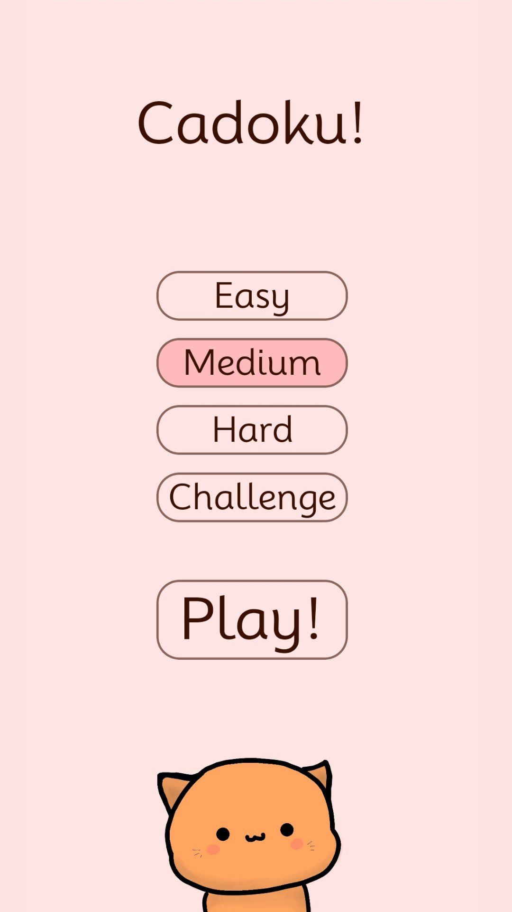
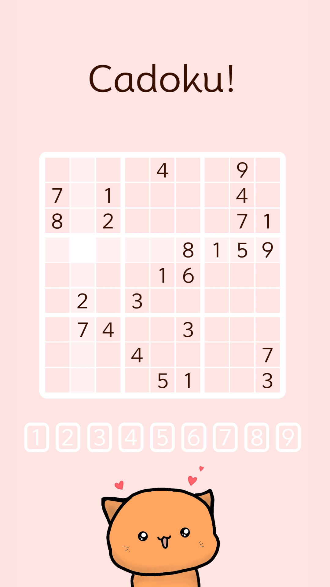
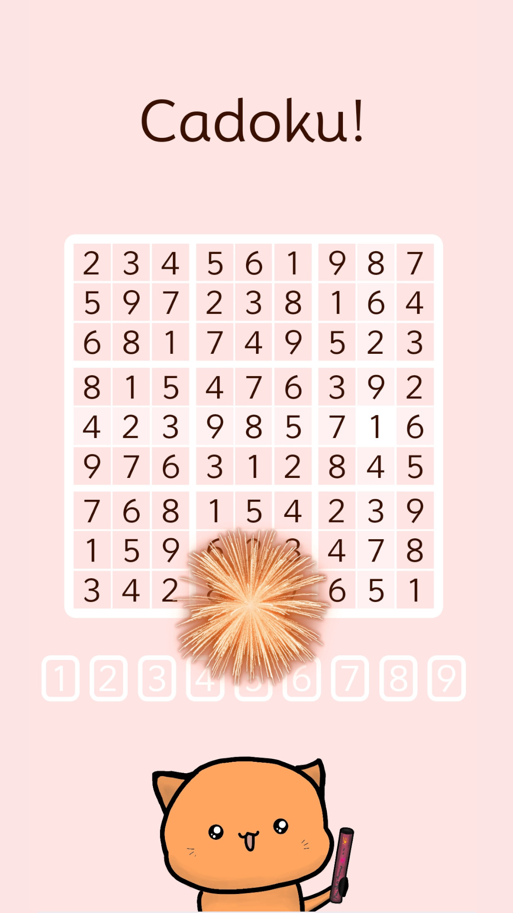

# Cadoku!

<p align="center">

</p>


A cozy, cat-themed and marshmallow-coloured Sudoku app.

Efficiently generates puzzles of varying difficulty that are guaranteed to be solvable without guessing by using recursive constraint propagation as suggested by [Peter Norvig](http://norvig.com/sudoku.html)
<p align="center">
  


</p>


Tip: Try petting the cat to see a surprise

## Download
Available for Android on [Google Play](https://play.google.com/store/apps/details?id=com.cadoku)

Or build your own version by cloning this repository

## Developing

Since files relevant to the signed release build are ignored by git, you must create `android/gradle.properties` and add:

```
org.gradle.jvmargs=-Xmx2048m -XX:MaxMetaspaceSize=512m
android.useAndroidX=true
android.enableJetifier=true
FLIPPER_VERSION=0.182.0
reactNativeArchitectures=armeabi-v7a,arm64-v8a,x86,x86_64
newArchEnabled=false
hermesEnabled=true
```
as well as rename `android/app/build copy.gradle` to `android/app/build.gradle`

## Privacy Note
[We don't collect data.](https://juliankarrer.github.io/Cadoku/)